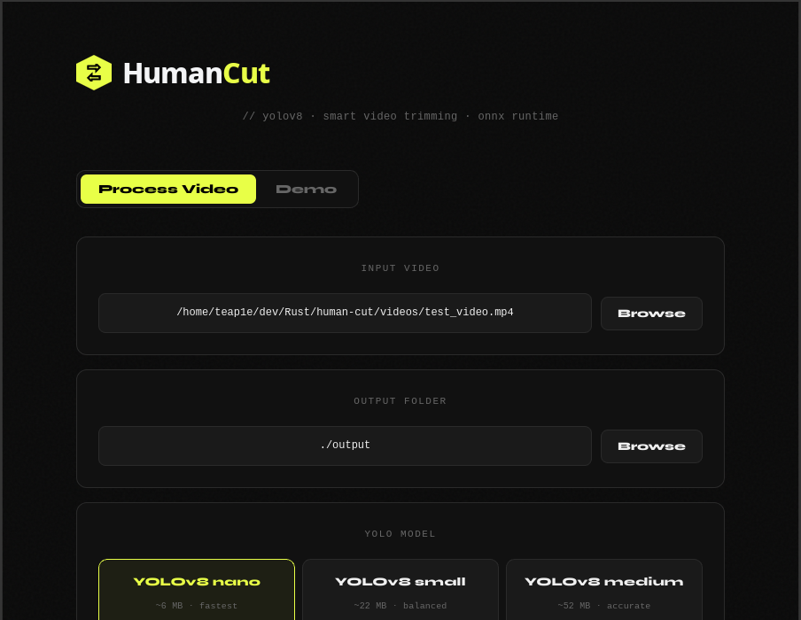
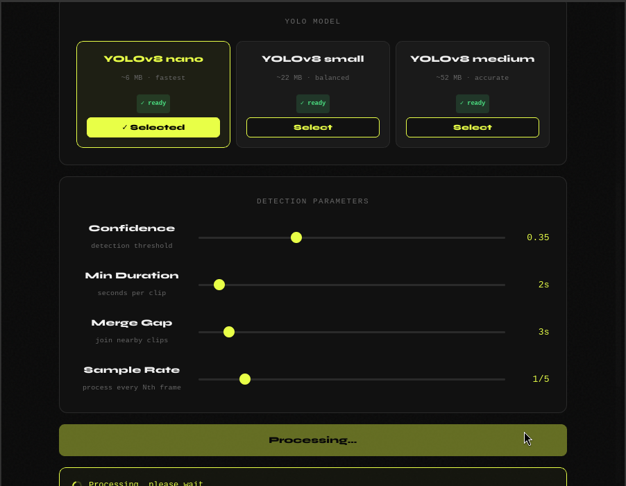
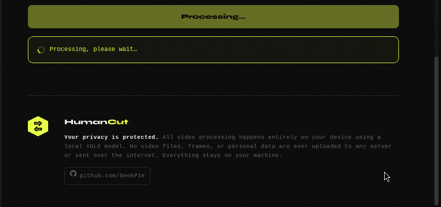
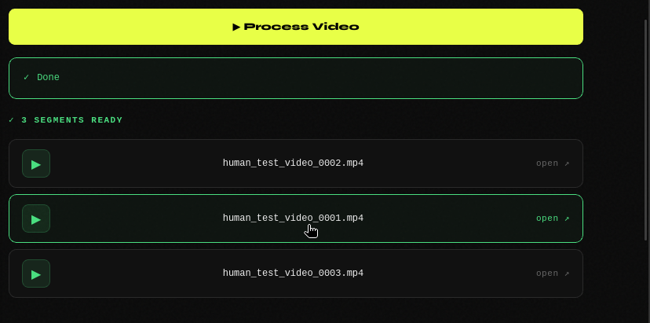

```
██╗  ██╗██╗   ██╗███╗   ███╗ █████╗ ███╗   ██╗ ██████╗██╗   ██╗████████╗
██║  ██║██║   ██║████╗ ████║██╔══██╗████╗  ██║██╔════╝██║   ██║╚══██╔══╝
███████║██║   ██║██╔████╔██║███████║██╔██╗ ██║██║     ██║   ██║   ██║   
██╔══██║██║   ██║██║╚██╔╝██║██╔══██║██║╚██╗██║██║     ██║   ██║   ██║   
██║  ██║╚██████╔╝██║ ╚═╝ ██║██║  ██║██║ ╚████║╚██████╗╚██████╔╝   ██║   
╚═╝  ╚═╝ ╚═════╝ ╚═╝     ╚═╝╚═╝  ╚═╝╚═╝  ╚═══╝ ╚═════╝ ╚═════╝    ╚═╝   
```

> Smart video trimming powered by YOLOv8 — extract only the moments that matter.

---

## Что это

HumanCut решает конкретную проблему систем видеонаблюдения: часы записи, из которых реально полезны минуты. Инструмент автоматически анализирует видео с помощью нейросети YOLOv8, находит все моменты где в кадре есть люди, и нарезает только их — отбрасывая пустые промежутки.

Это позволяет:
- сократить объём хранимых записей в разы
- ускорить ручной просмотр архива
- автоматизировать предобработку данных для систем аналитики

Всё работает локально — никаких облаков, никакой передачи данных.

---

## Roadmap

Проект активно развивается. В планах:

- **API endpoint** для интеграции с системами видеонаблюдения через HTTP/WebSocket — возможность принимать видеопоток в реальном времени и на лету складывать сегменты с людьми
- **Live streaming** — обработка RTSP/RTMP потоков без сохранения исходника
- **Идентификация людей** — разделение по персонам: если в кадре регулярно появляется один и тот же человек (например охранник), его клипы автоматически группируются в отдельную папку
- **GUI** — десктопное приложение на Tauri (в разработке)

---

## Требования

- Rust 1.77+
- `ffmpeg` и `ffprobe` в PATH
- YOLOv8 ONNX модель (скачивается командой)

```bash
# Ubuntu / Debian
sudo apt install ffmpeg
```

---

## Установка

```bash
git clone https://github.com/GeekP1e/humancut
cd humancut
cargo build --release
```

---

## CLI

### Команды

| Команда | Описание |
|---|---|
| `extract` | Обработать видео и нарезать сегменты с людьми |
| `download-model` | Скачать YOLO модель |
| `generate-config` | Создать шаблон конфига |
| `demo` | Скачать тестовое видео и запустить обработку |

---

### extract

Основная команда. Анализирует видео и экспортирует сегменты с людьми.

```bash
# Обработать один файл
cargo run -- extract ./videos/footage.mp4

# Обработать все видео из папки ./videos/
cargo run -- extract

# С параметрами
cargo run -- extract ./videos/footage.mp4 \
  --output ./clips \
  --confidence 0.35 \
  --min-duration 2.0 \
  --merge-gap 3.0 \
  --sample-rate 5
```

**Параметры:**

| Параметр | По умолчанию | Описание |
|---|---|---|
| `INPUT` | `./videos` | Путь к файлу или папке с видео |
| `--output` | `./output` | Куда сохранять сегменты |
| `--config` | — | Путь к YAML конфигу |
| `--confidence` | `0.5` | Порог уверенности YOLO (0.1–0.9) |
| `--min-duration` | `1.0` | Минимальная длина клипа в секундах |
| `--merge-gap` | `5.0` | Склеить клипы с зазором меньше N секунд |
| `--sample-rate` | `5` | Анализировать каждый N-й кадр |

**Структура вывода:**

```
output/
└── footage/
    ├── human_footage_0001.mp4
    ├── human_footage_0002.mp4
    └── human_footage_0003.mp4
```

**Пример вывода в терминале:**

```
Processing video: footage.mp4
Confidence: 0.35, Sample rate: 5
Loading YOLO model from: ./models/yolov8n.onnx

[результат обработки — допишу]

✅ Successfully exported 3 segments in 12.4s
Original size: 245.00 MB
Output size: 38.20 MB (15.6% of original)
```

---

### download-model

Скачивает YOLO модель в папку `./models/`.

```bash
cargo run -- download-model nano    # ~6 MB,  быстрее
cargo run -- download-model small   # ~22 MB, баланс
cargo run -- download-model medium  # ~52 MB, точнее
```

Если модель уже скачана — повторная загрузка не произойдёт.

---

### generate-config

Создаёт YAML файл с настройками по умолчанию.

```bash
cargo run -- generate-config
cargo run -- generate-config my_config.yaml
```

Пример `config.yaml`:

```yaml
yolo_confidence: 0.35
min_segment_duration: 2.0
merge_gap_seconds: 3.0
sample_rate_frames: 5
output_dir: ./output
```

Затем используй конфиг при обработке:

```bash
cargo run -- extract footage.mp4 --config config.yaml
```

---

### demo

Скачивает тестовое видео с людьми и запускает полный цикл обработки.

```bash
cargo run -- demo
cargo run -- demo --output ./demo_output
```

Удобно для проверки установки без собственного видео.

---

## Рекомендованные параметры

```yaml
yolo_confidence: 0.35      # nano модель пропускает людей при высоком пороге
min_segment_duration: 2.0  # не терять короткие появления
merge_gap_seconds: 3.0     # склеивать эпизоды одной сцены
sample_rate_frames: 5      # каждые ~0.17с при 30fps — достаточно
```

При плохом освещении или низком качестве видео снижайте `confidence` до `0.25`.

---

## UI






## Приватность

Все вычисления выполняются локально на вашем устройстве. Видеофайлы, кадры и любые данные никуда не передаются и не покидают вашу машину.

---

## 📧 Контакты

[](https://github.com/GeekP1e)
[](https://github.com/GeekP1e/human-cut)